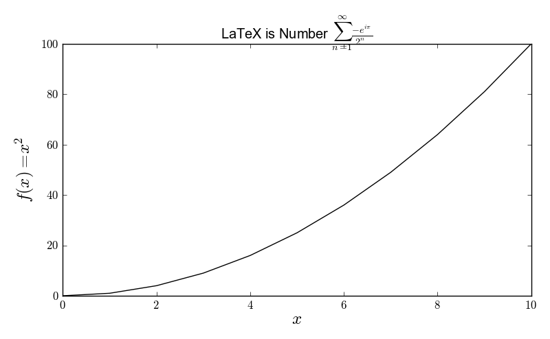

Examples: examples/latex.py
===========================

Back to :ref:`examples-gallery`

.. code-block:: python
    :linenos:

    line = Line()
    line.xValues = [0, 1, 2, 3, 4, 5,
    6, 7, 8, 9, 10]
    line.yValues = [0, 1, 4, 9, 16, 25,
    36, 49, 64, 81, 100]
    
    plot = Plot()
    plot.useLatexLabels()
    plot.xLabel = r"$x$"
    plot.yLabel = r"$f(x) = x^2$"
    plot.title = (
    r"LaTeX is Number $\sum_{n=1}^{\infty}"
    "\frac{-e^{i\pi}}{2^n}$")
    plot.add(line)
    plot.tight = True
    plot.axesLabelSize = 18
    
    plot.save("latex.png")
    
