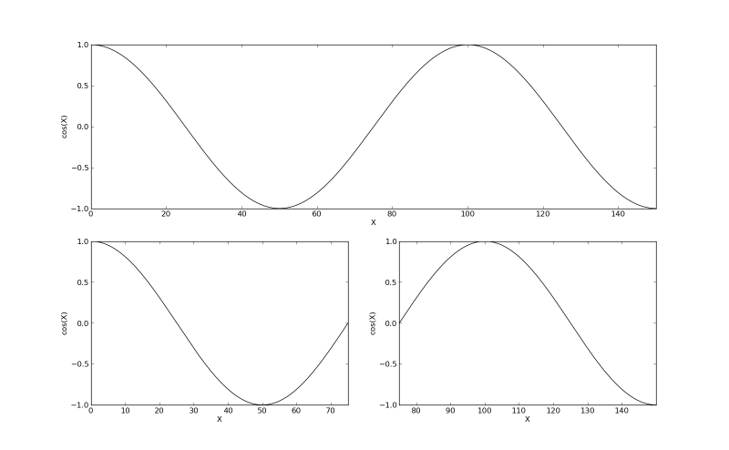

Examples: examples/split.py
===========================

Back to :ref:`examples-gallery`

.. code-block:: python
    :linenos:

    import numpy
    
    line = Line()
    line.xValues = numpy.arange(0, 150, 0.01)
    line.yValues = numpy.cos(.02 * numpy.pi * line.xValues)
    
    plot = Plot()
    plot.add(line)
    plot.xLimits = (0, 150)
    plot.yLimits = (-1, 1)
    plot.xLabel = "X"
    plot.yLabel = "cos(X)"
    splitPlots = plot.split(2)
    
    layout = PlotLayout()
    layout.width = 2
    layout.addPlot(plot, grouping="unsplit")
    
    for s in splitPlots:
    layout.addPlot(s, grouping="splits")
    
    layout.save("split.png")
