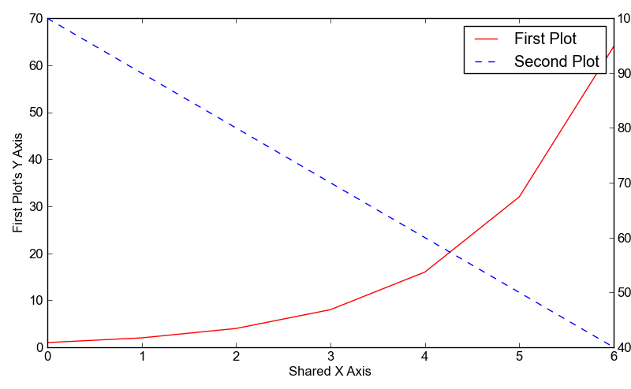

Examples: examples/twinx.py
===========================

Back to :ref:`examples-gallery`

.. code-block:: python
    :linenos:

    line1 = Line()
    line1.xValues = range(7)
    line1.yValues = [1, 2, 4, 8, 16, 32, 64]
    line1.label = "First Plot"
    line1.lineStyle = "-"
    line1.color = "red"
    
    line2 = Line()
    line2.xValues = range(7)
    line2.yValues = [100, 90, 80, 70, 60, 50, 40]
    line2.label = "Second Plot"
    line2.lineStyle = "--"
    line2.color = "blue"
    
    plot = Plot()
    plot.add(line1)
    plot.add(line2)
    plot.xLabel = "Shared X Axis"
    plot.yLabel = "First Plot's Y Axis"
    plot.setTwinX("Second Plot's Y Axis", 1)
    plot.hasLegend()
    
    plot.save("twinx.png")
