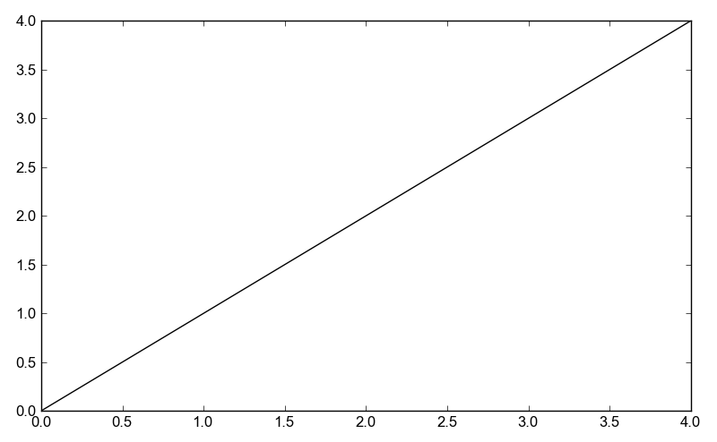

Examples: examples/unordered.py
===============================

Back to :ref:`examples-gallery`

.. code-block:: python
    :linenos:

    line = Line()
    line.xValues = [2, 1, 3, 4, 0]
    line.yValues = [2, 1, 3, 4, 0]
    
    plot = Plot()
    plot.add(line)
    
    plot.save("unordered.png")
