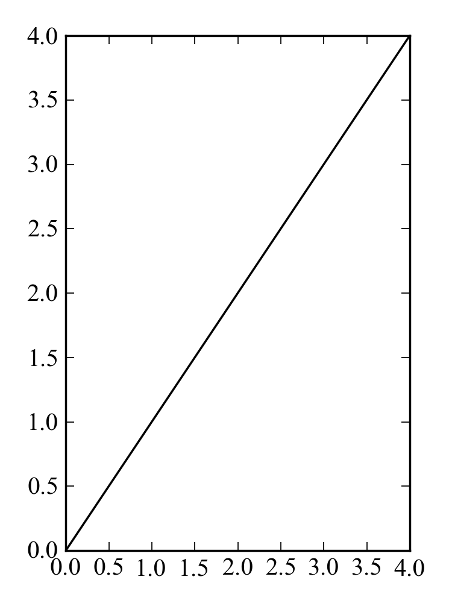

Examples: examples/exactsize.py
===============================

Back to :ref:`examples-gallery`

.. code-block:: python
    :linenos:

    plot = Plot()
    line = Line()
    plot.setDimensions(3, 4)
    
    line.xValues = range(5)
    line.yValues = range(5)
    
    plot.add(line)
    plot.save("exactsize.png")
