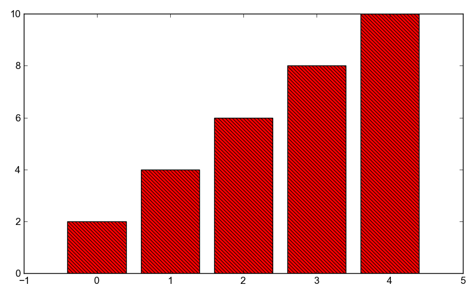

Examples: examples/hatchedbars.py
=================================

Back to :ref:`examples-gallery`

.. code-block:: python
    :linenos:

    bar = Bar()
    
    bar.xValues = range(5)
    bar.yValues = [2, 4, 6, 8, 10]
    bar.hatch = r"\\"
    bar.color="red"
    bar.edgeColor="black"
    
    plot = Plot()
    plot.add(bar)
    plot.save("hatchedbars.png")
