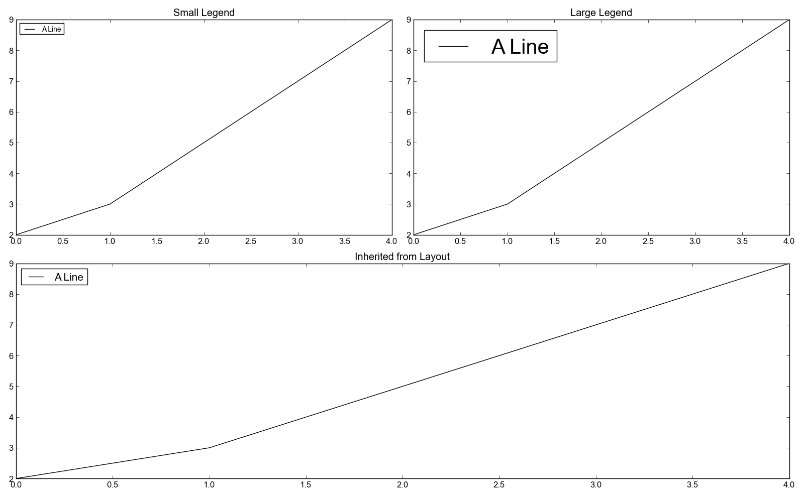

Examples: examples/legendLabelSizes.py
======================================

Back to :ref:`examples-gallery`

.. code-block:: python
    :linenos:

    line = Line()
    line.xValues = range(5)
    line.yValues = [2,3,5,7,9]
    line.label = "A Line"
    
    linePlot1 = Plot()
    linePlot1.title = "Small Legend"
    linePlot1.add(line)
    linePlot1.hasLegend()
    linePlot1.legendLabelSize = 10
    
    linePlot2 = Plot()
    linePlot2.title = "Large Legend"
    linePlot2.add(line)
    linePlot2.hasLegend()
    linePlot2.legendLabelSize = 30
    
    linePlot3 = Plot()
    linePlot3.title = "Inherited from Layout"
    linePlot3.add(line)
    linePlot3.hasLegend()
    
    layout = PlotLayout()
    layout.width = 2
    layout.addPlot(linePlot1)
    layout.addPlot(linePlot2)
    layout.addPlot(linePlot3)
    layout.legendLabelSize = 15
    layout.save("legendLabelSizes.png")
