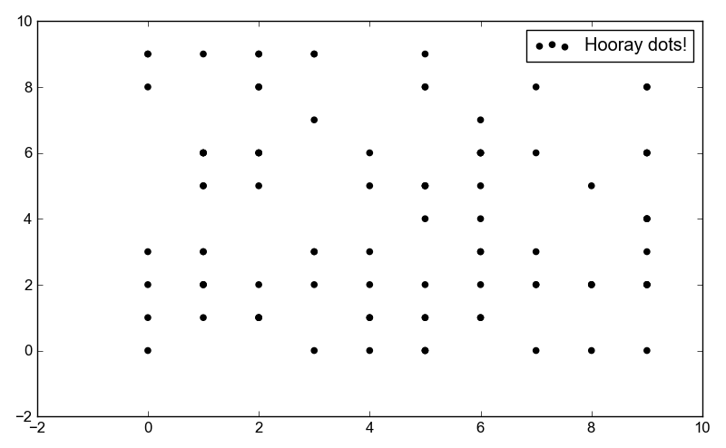

Examples: examples/scatter.py
=============================

Back to :ref:`examples-gallery`

.. code-block:: python
    :linenos:

    scatter = Scatter()
    scatter.label="Hooray dots!"
    
    for i in range(100):
    scatter.xValues.append(random.uniform(0, 10))
    scatter.yValues.append(random.uniform(0, 10))
    
    plot = Plot()
    plot.hasLegend()
    plot.add(scatter)
    plot.save("scatter.png")
