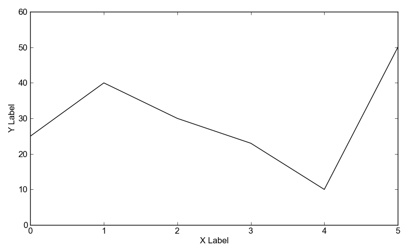

Examples: examples/simpleline.py
================================

Back to :ref:`examples-gallery`

.. code-block:: python
    :linenos:

    line = Line()
    line.yValues = [25, 40, 30, 23, 10, 50]
    line.xValues = range(len(line.yValues))
    
    plot = Plot()
    plot.add(line)
    plot.xLabel = "X Label"
    plot.yLabel = "Y Label"
    plot.yLimits = (0, 60)
    plot.save("simpleline.png")
