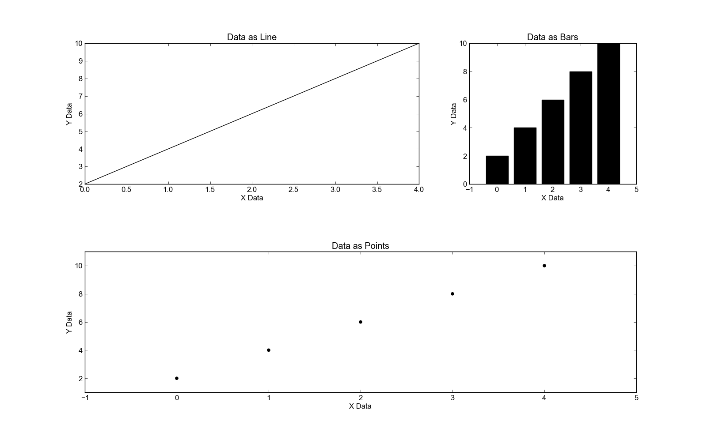

Examples: examples/weightedlayout.py
====================================

Back to :ref:`examples-gallery`

.. code-block:: python
    :linenos:

    line = Line()
    line.xValues = range(5)
    line.yValues = [2, 4, 6, 8, 10]
    
    linePlot = Plot()
    linePlot.add(line)
    linePlot.xLabel = "X Data"
    linePlot.yLabel = "Y Data"
    linePlot.title = "Data as Line"
    
    bar = Bar()
    bar.xValues = range(5)
    bar.yValues = [2, 4, 6, 8, 10]
    
    barPlot = Plot()
    
    barPlot.add(bar)
    barPlot.xLabel = "X Data"
    barPlot.yLabel = "Y Data"
    barPlot.title = "Data as Bars"
    
    scatter = Scatter()
    scatter.xValues = range(5)
    scatter.yValues = [2, 4, 6, 8, 10]
    
    scatterPlot = Plot()
    scatterPlot.add(scatter)
    scatterPlot.xLabel = "X Data"
    scatterPlot.yLabel = "Y Data"
    scatterPlot.title = "Data as Points"
    
    layout = WeightedPlotLayout()
    # Plots in the same grouping are placed together on the same line
    layout.addPlot(linePlot, grouping="topRow", weight=2)
    layout.addPlot(barPlot, grouping="topRow")
    
    # Plots without a grouping are arranged as follows:
    
    # * While you can make a row of N plots, where N is the size of the plot
    # grouping with the largest size, do so.
    
    # * If you can't make a row of N plots, make the plots stretch across a
    # single row.
    
    layout.addPlot(scatterPlot)
    
    layout.save("weightedlayout.png")
