.. _examples-gallery:

Examples
========

This page provides a gallery of example Boomslang scripts. Clicking on one of
the images below will direct you to that image and a listing of its source code.

    

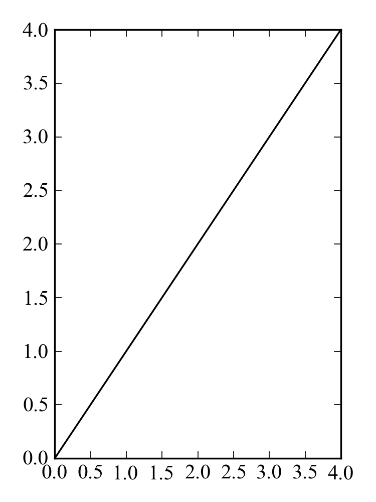
    

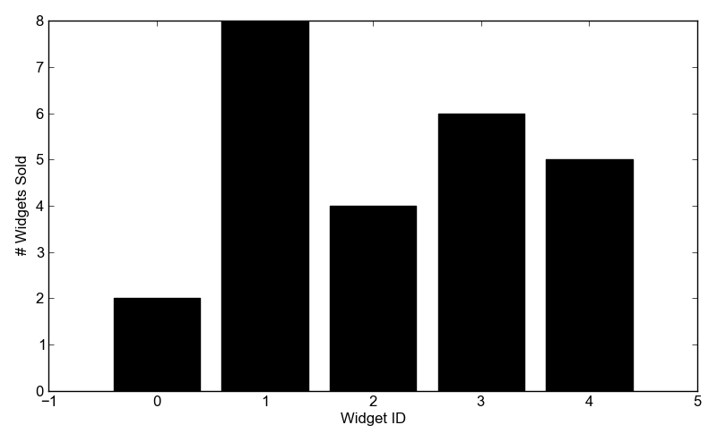
    

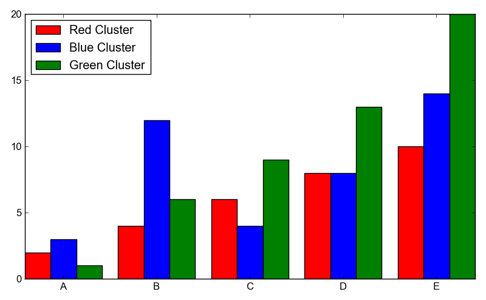
    

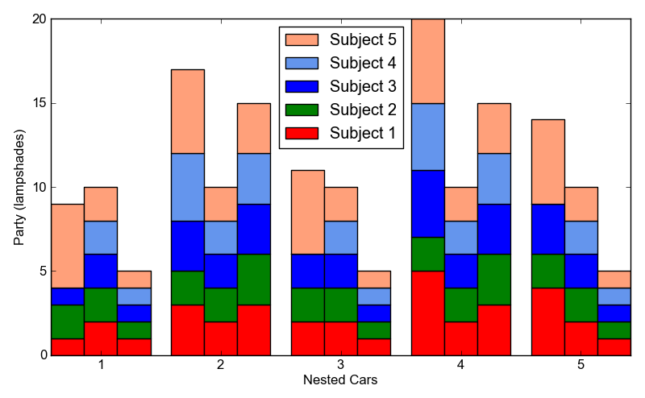
    

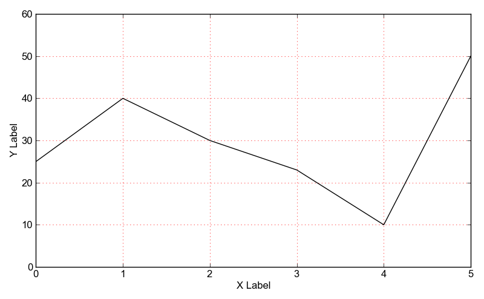
    

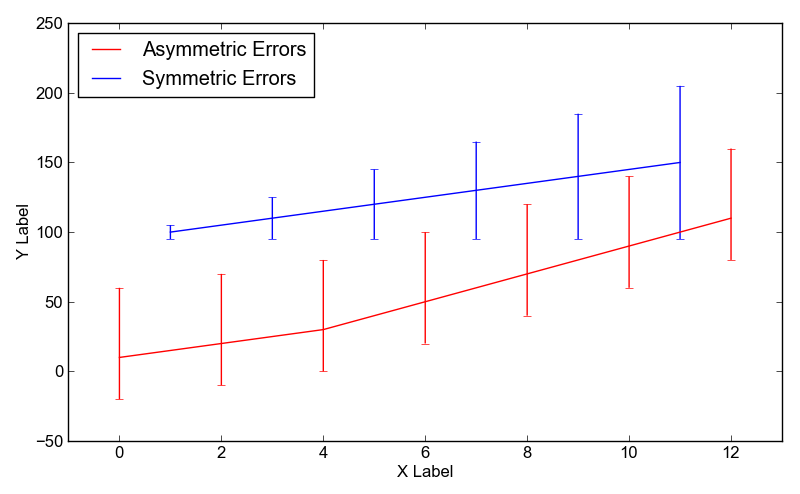
    

.. image:: examples/fontsizes.png
   :target: examples-fontsizes.html
    

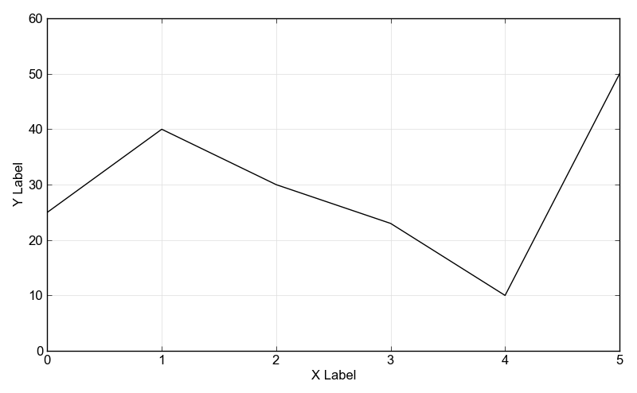
    

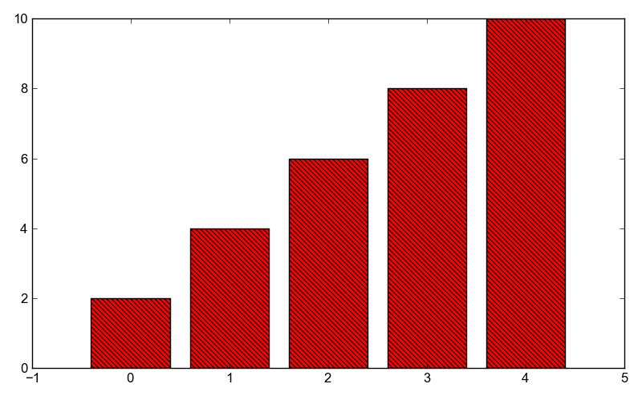
    

.. image:: examples/inset.png
   :target: examples-inset.html
    

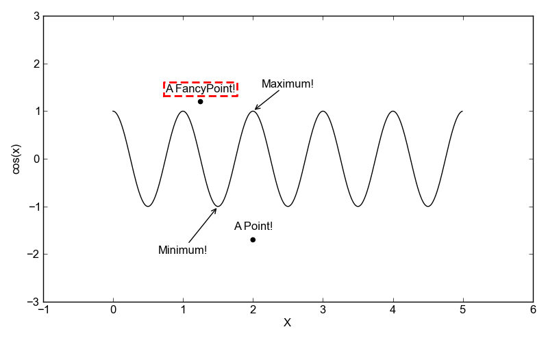
    

.. image:: examples/latex.png
   :target: examples-latex.html
    

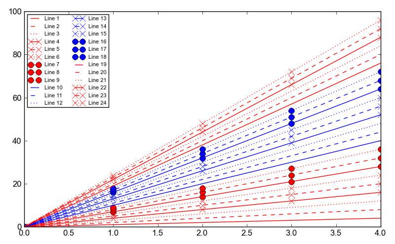
    

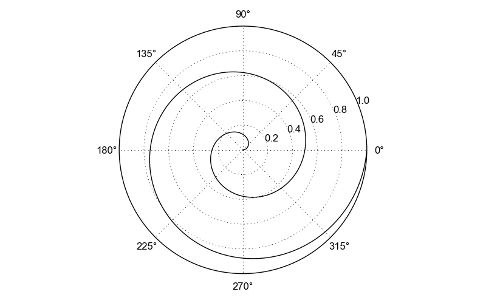
    

.. image:: examples/scatter.png
   :target: examples-scatter.html
    

.. image:: examples/simpleline.png
   :target: examples-simpleline.html
    

.. image:: examples/stackedbar.png
   :target: examples-stackedbar.html
    

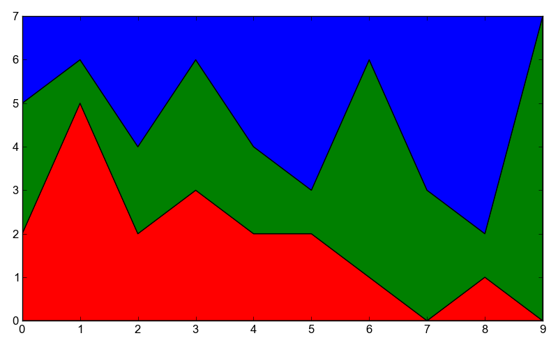
    

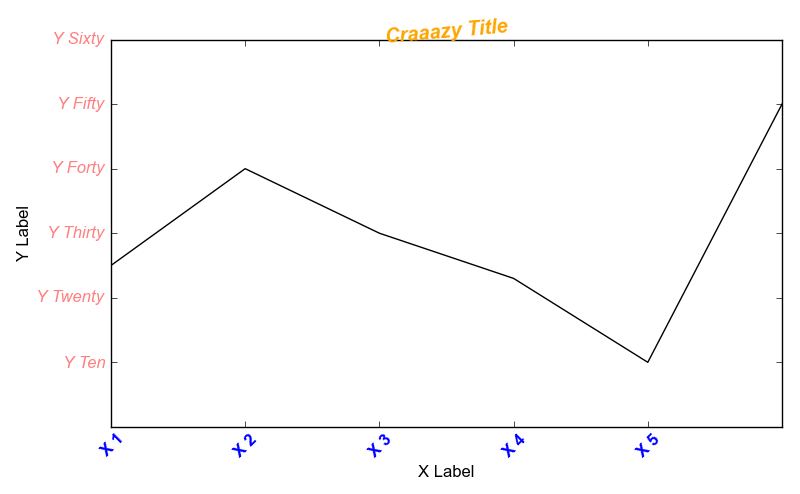
    

.. image:: examples/twinx.png
   :target: examples-twinx.html
    

.. image:: examples/unordered.png
   :target: examples-unordered.html
    

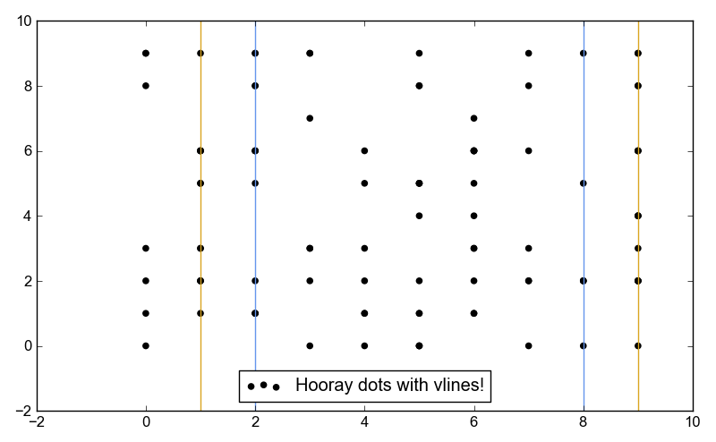
    

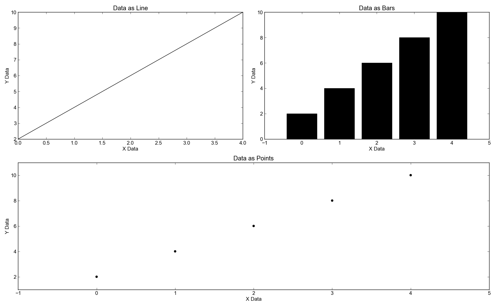
    

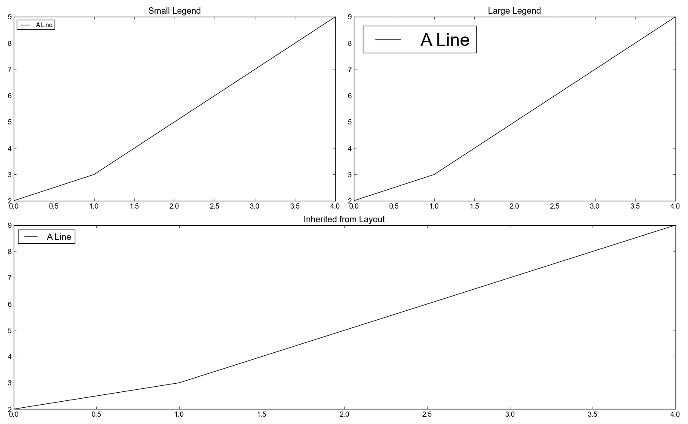
    

.. image:: examples/logscale.png
   :target: examples-logscale.html
    

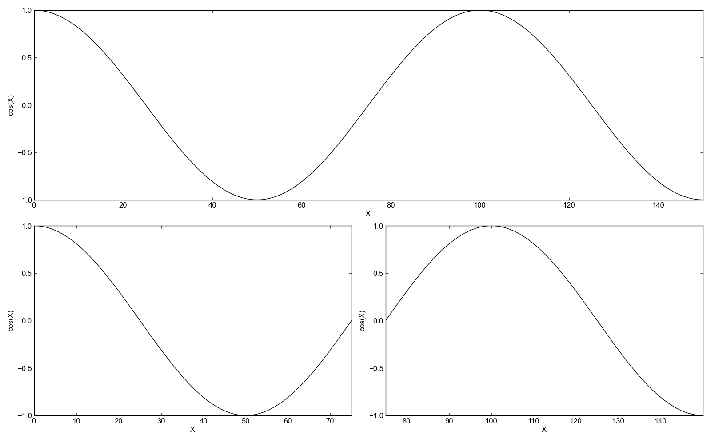
    

.. image:: examples/weightedlayout.png
   :target: examples-weightedlayout.html
    

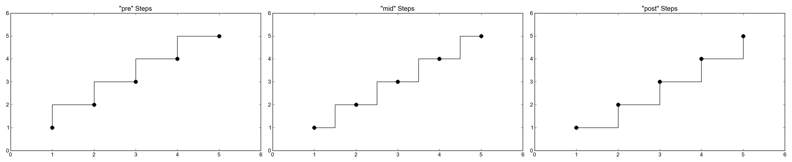
    
